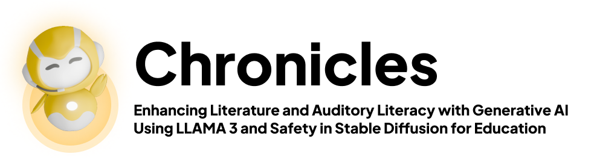
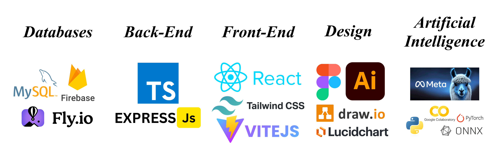
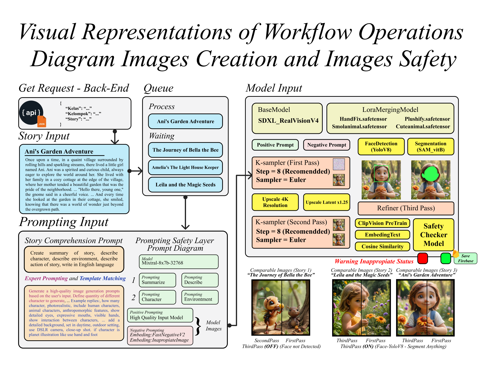
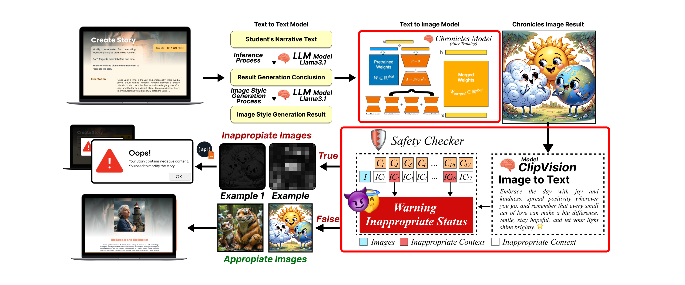
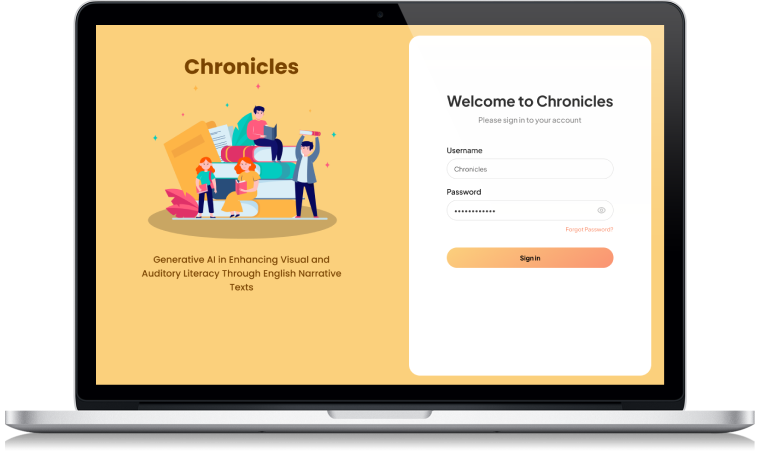

# Chronicles



Chronicles is a web-based educational application designed to enhance English narrative writing skills for students, professionals, and educators through interactive and innovative learning methods.

The platform combines collaborative and independent learning tools with AI-powered image generation, story similarity checker, grading recommendation, read-aloud story, and quiz generation.

[Visit Chronicles](https://chronicles.heritsam.dev/)

## Table of Contents

- [Overview](#overview)
- [Folder Structure](#folder-structure)
- [Tech Stack](#tech-stack)
- [Architecture](#architecture)
- [Llama Utilization Overview](#llama-utilization-overview)
- [Setup](#setup)
  - [Prerequisites](#prerequisites)
  - [Installation](#installation)
- [Usage](#usage)
  - [Running the AI](#running-the-ai-service)
  - [Running the Server](#running-the-server)
  - [Running the Client](#running-the-client)
- [Chronicles Application](#chronicles-application)
- [Contribution](#contribution)
- [License](#license)

---

## Overview

English language proficiency often tends to decline, with many individuals, including students, experiencing difficulties in learning English. Very few have had a comfortable English learning experience. Therefore, Chronicles presents itself as an innovative solution in English language education, making the learning process easier and more comfortable. Chronicles offers features that enhance the English learning experience, including AI-powered image generation, story similarity checker, grading recommendation, read-aloud story, and quiz generation using Llama 3.

The target market for Chronicles includes students, professionals, and educators. Chronicles aims to serve these groups through interactive and innovative learning methods, making English language acquisition more accessible and engaging for 50+ million of users.

Chronicles is expected to have several positive impacts. It will increase engagement and motivation in learning English through its interactive and innovative approaches. Users will experience improved English language skills, particularly in writing and understanding narrative texts. Chronicles will enhance efficiency for educators in assessing and providing feedback on learners' work. Overall, Chronicles will contribute to the improvement of English language proficiency, potentially leading to better educational and professional opportunities. Chronicles aligns with SDG Goal 4 (Quality Education) by providing inclusive and equitable quality education and promoting lifelong learning opportunities for all. By improving access to effective English language learning tools, Chronicles supports the development of essential skills that can enhance individuals' educational and career prospects, regardless of their background or circumstances.

## Folder Structure

This repository contains three main components for the Chronicles project, which is designed to enhance English language learning through interactive and innovative methods. The components are divided into three folders: `ai`, `backend`, and `frontend`.

- **ai**: Contains the code for the AI models that generate images, filter inappropriate content, create quizzes, and perform other AI-related tasks for English language learning.
- **backend**: Hosts the Node.js server, managing user requests, authentication, and integration with AI services to support the learning experience.
- **frontend**: The front-end application built with React, where users interact with the platform to engage in various English learning activities, such as narrative text creation and interactive exercises.

## Tech Stack



- **AI Model**: Llama3
- **Embeddings**: TF-IDF
- **API Framework**: FastAPI (Python), Express.js (Node.js)
- **Database**: MySQL, Firebase
- **Frontend**: React, Vite, Tailwind CSS
- **Client** : React JS, Tailwind CSS, Vite
- **Deployment** : Vercel, Fly.io, ngrok




## Architecture

The project is built using a microservices architecture, with each component independently handling specific tasks:

1. AI Service (`ai` folder): Utilizes Llama 3 models for various tasks such as image generation, content filtering, quiz creation, and other language learning-related functionalities.
2. API Server (`backend` folder): Handles user requests, authenticates users, and interacts with the AI services and database to support the learning platform's operations.
3. Client Application (`frontend` folder): A React-based front-end where users can engage with various English learning activities, including narrative text creation, interactive exercises, and AI-assisted learning tools.

## Llama Utilization Overview
For image generation, we leverage Llama to craft prompts that are used to generate high-quality images via Stable Diffusion. The images are then filtered for appropriateness using Llama's advanced image captioning capabilities and deep learning models that identify unsuitable content. Llama is also instrumental in our story similarity checker, utilizing TF-IDF and RAKE techniques to analyze and compare narrative texts. For grading recommendations, we use Llama's regex capabilities to provide tailored feedback. Additionally, Llama supports the read-aloud feature by powering the VALL-E X model for zero-shot speech synthesis, ensuring accurate and natural-sounding speech. Finally, Llama is utilized to generate quiz content in JSON format, streamlining the creation of interactive assessments. Overall, Llama's integration into Chronicles enhances its functionality, making the learning experience more dynamic and effective.

## Setup

### Prerequisites

- Python 3.8+
- Node.js 14+
- Virtual environment tool (e.g., `venv` or `conda`)

### Installation

1. **Clone the repository**:
   ```bash
   git clone https://github.com/yourusername/chronicles.git
   cd chronicles
   # read the README.md
   ```

## Usage

### Running the AI Service

To start the LLM service:

> Note: the jupyter notebook is intended to be run in Google Colab or a local environment with the necessary dependencies installed.

### Running the Server

To start the FastAPI and Node.js servers:
```bash
cd server
npm install
npm start
```

### Running the Client

To start the client application:
```bash
cd client
npm install
npm run dev
```

## Chronicles Application
Chronicles is a web application that can be opened in a browser.

1. Login Page

> Users need to log in with the provided username and password.

2. Create Story Page (Image Generation and Safety Image)


## Contribution

Chronicles Developer :
- Agung Hadi Winoto
  - [LinkedIn](https://www.linkedin.com/in/agung-hadi-winoto/)
  - [Github](https://github.com/4fortunezw)
- Nadya Khairani
  - [LinkedIn](https://www.linkedin.com/in/nadyaakhairani/)
  - [Github](https://github.com/nadyaakhairani)
- Ariq Heritsa Maalik
  - [LinkedIn](https://www.linkedin.com/in/heritsam/)
  - [Github](https://github.com/heritsam)
- Adrian Putra Pratama Badjideh
  - [LinkedIn](https://www.linkedin.com/in/adrian-putra-pratama-badjideh-8a2492238/)
  - [Github](https://github.com/glazeradr)

Feel free to open an issue or submit a pull request if you'd like to contribute to this project.


## License

This project is licensed under the MIT License. See the [LICENSE](./LICENSE) file for more details.
